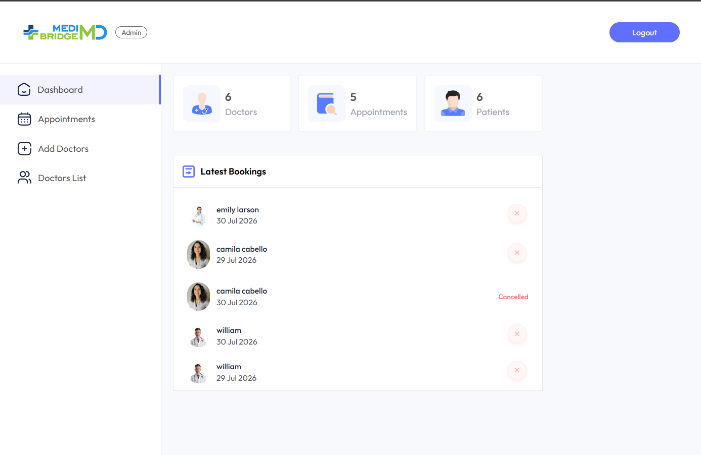
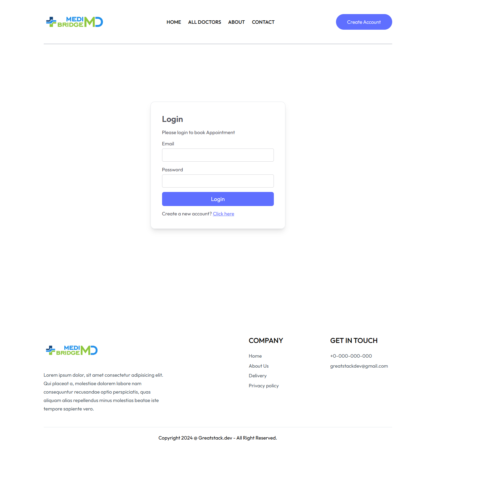
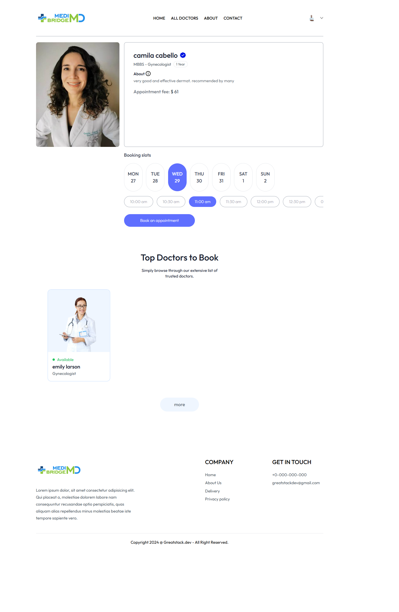
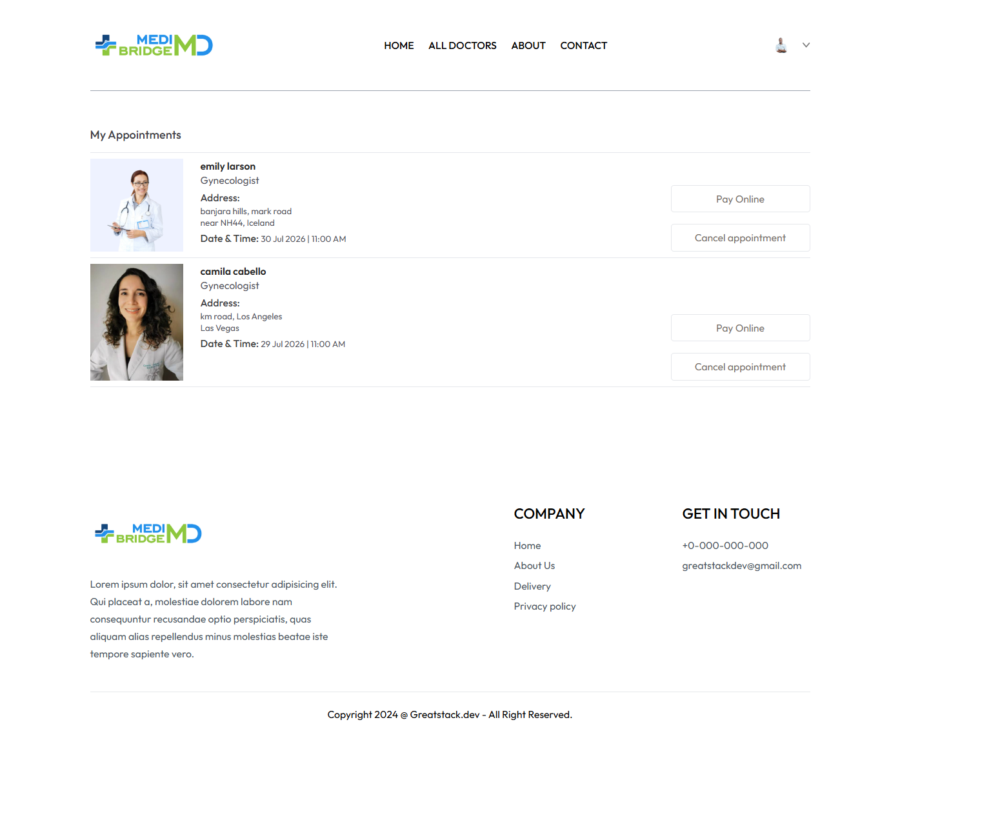
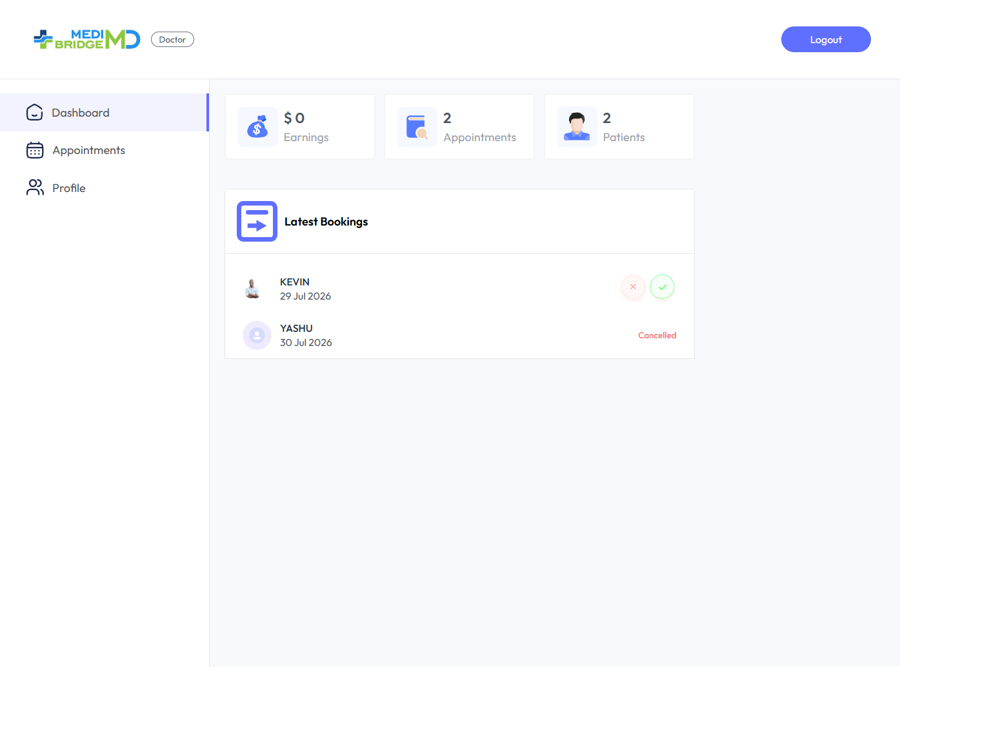

# 🏥 MediBridge - Doctor Appointment Booking System

MediBridge is a full-stack **MERN** (MongoDB, Express.js, React.js, Node.js) web application that simplifies the process of booking doctor appointments online. It provides dedicated dashboards for **Patients**, **Doctors**, and **Administrators**, enabling efficient appointment management and healthcare services.

---


## 📸 Project Preview

### 🏠 Home Page


### 👨‍💼 Admin Dashboard



## 🚀 Features

### 👤 Patient
- ✅ Register & Login
- ✅ Browse Doctors
- ✅ Book Appointments
- ✅ View Appointment History
- ✅ Cancel Appointments
- ✅ Manage Profile

### 👨‍⚕️ Doctor

- ✅ Secure Authentication
- ✅ Doctor Dashboard
- ✅ View Scheduled Appointments
- ✅ Manage Availability
- ✅ Update Profile Information

### 👨‍💼 Admin

- ✅ Admin Dashboard
- ✅ Add Doctors
- ✅ Manage Doctor Profiles
- ✅ View All Appointments
- ✅ Monitor Users

---

## 🛠 Tech Stack

### Frontend
- React.js
- Vite
- React Router
- Axios
- React Toastify

### Backend
- Node.js
- Express.js

### Database
- MongoDB
- Mongoose

### Authentication
- JSON Web Token (JWT)

### Cloud Services
- Cloudinary (Image Uploads)
- Multer

---

## 📂 Project Structure

```
MediBridge/
│
├── frontend/        # Patient Web Application
├── admin/           # Admin Dashboard
├── backend/         # REST API & Database
└── README.md
```

---

## 🏗 Architecture

```text
React (Frontend)
        │
 REST API (Axios)
        │
        ▼
Node.js + Express
        │
        ▼
MongoDB Atlas
```

## ⚙️ Installation

### 1. Clone the Repository

```bash
git clone https://github.com/yashaswinikaranam/MediBridge.git
cd MediBridge
```

---

### 2. Backend Setup

```bash
cd backend
npm install
npm start
```

---

### 3. Frontend Setup

```bash
cd frontend
npm install
npm run dev
```

---

### 4. Admin Panel

```bash
cd admin
npm install
npm run dev
```

---

## 🔑 Environment Variables

Create a `.env` file inside the `backend` directory.

```env
MONGODB_URI=your_mongodb_connection_string

JWT_SECRET=your_jwt_secret

ADMIN_EMAIL=your_admin_email

ADMIN_PASSWORD=your_admin_password

CLOUDINARY_CLOUD_NAME=your_cloudinary_name

CLOUDINARY_API_KEY=your_cloudinary_key

CLOUDINARY_SECRET_KEY=your_cloudinary_secret
```

---

## 📸 Screenshots


### Patient Login



### Appointment Booking



### Patient Dashboard



### Doctor Dashboard




---

## 🔮 Future Improvements

- 💳 Online Payment Gateway
- 📧 Email Notifications
- 📱 SMS Appointment Reminders
- ⭐ Doctor Ratings & Reviews
- 🎥 Video Consultation
- 📅 Google Calendar Integration

---

## 👩‍💻 Author

**Yashaswini Karanam**

B.Tech Computer Science Engineering

- GitHub: https://github.com/yashaswinikaranam
- LinkedIn: https://www.linkedin.com/in/yashaswini-karanam/

---

## 📄 License

This project is licensed under the MIT License.

## 📌 Status

🚧 This project is actively being improved with additional features and UI enhancements.
